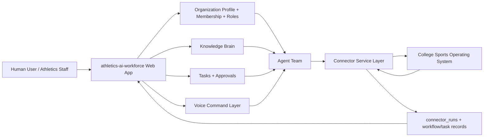
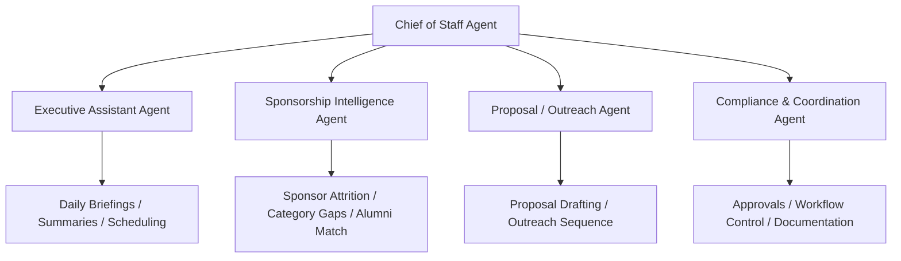
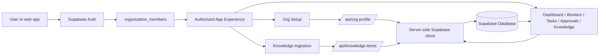
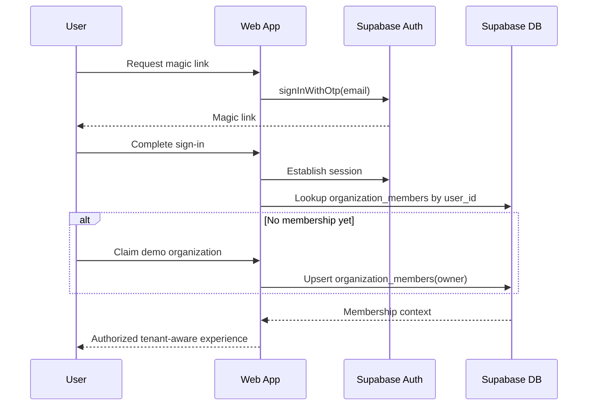
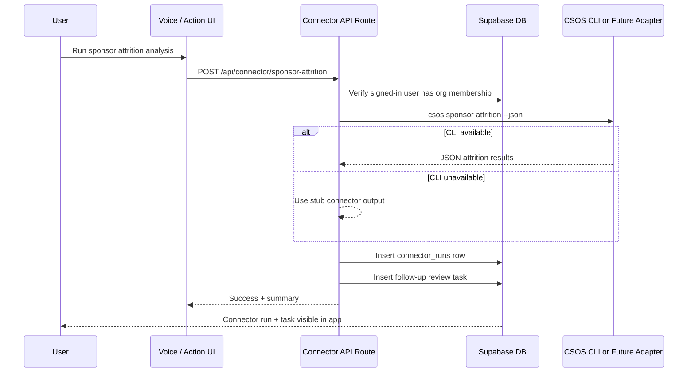
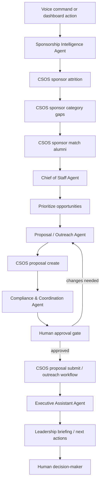
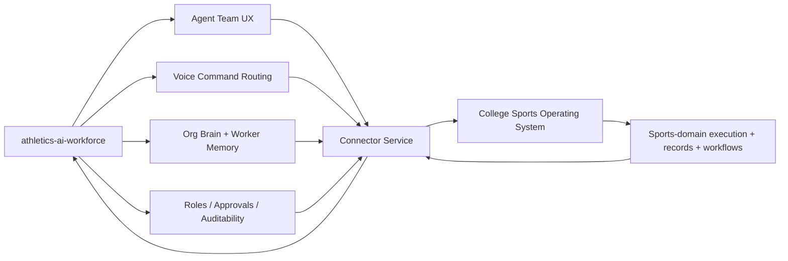
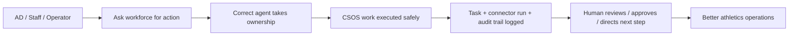

# WORKFLOW_SYSTEM_DIAGRAMS.md

## Purpose
Visualize how the athletics-ai-workforce system operates now, how the agent team is structured, and how the platform connects to the College Sports Operating System (CSOS) as the product matures.

---

## 1. Platform view: workforce + human + CSOS

---

## 2. Agent team map

---

## 3. Current system behavior

### What is live now
- Supabase-backed production app
- server-side write path for org profile + knowledge items
- live reads on dashboard/workers/tasks/approvals/knowledge surfaces
- Playwright smoke coverage + safe submit coverage
- auth scaffold + membership bootstrap path
- first connector run API path scaffolded

---

## 4. First authenticated tenant flow

---

## 5. First CSOS connector run path

---

## 6. Future closed-loop athletics workflow

---

## 7. North-star engagement model with CSOS

## Interpretation
- **athletics-ai-workforce** is the orchestration layer
- **CSOS** is the athletics execution layer
- **agents** are the operational workforce
- **voice** becomes an input layer, not a separate product silo
- **humans** remain in the loop for approvals, prioritization, and governance

---

## 8. Simplest product story

This is the product in one sentence:

**A human-led AI workforce that understands the athletics organization, routes work to specialized agents, executes domain actions through CSOS safely, and keeps everything auditable.**
